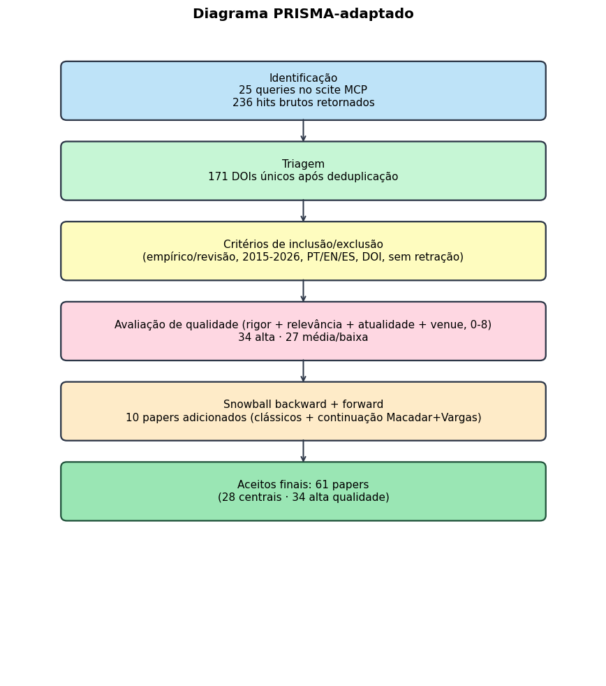
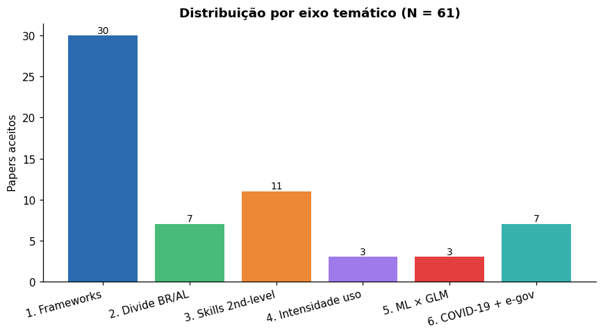
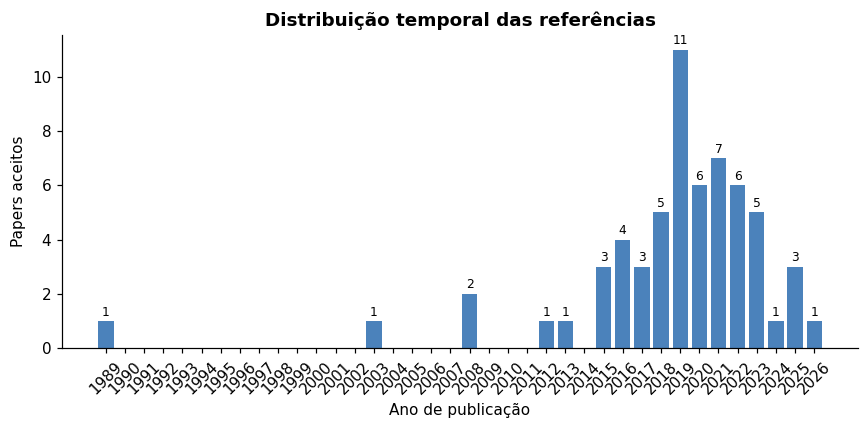
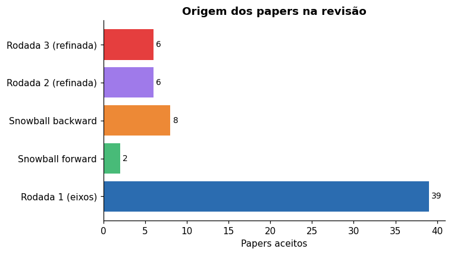
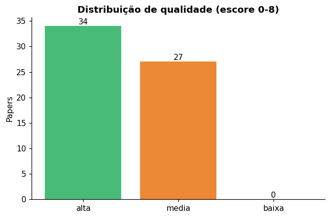
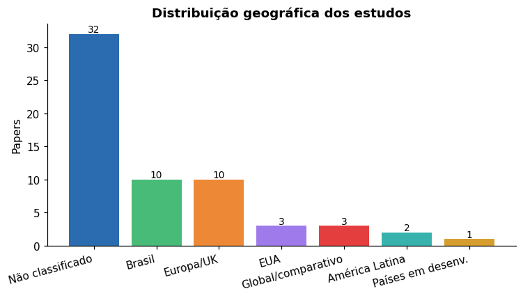
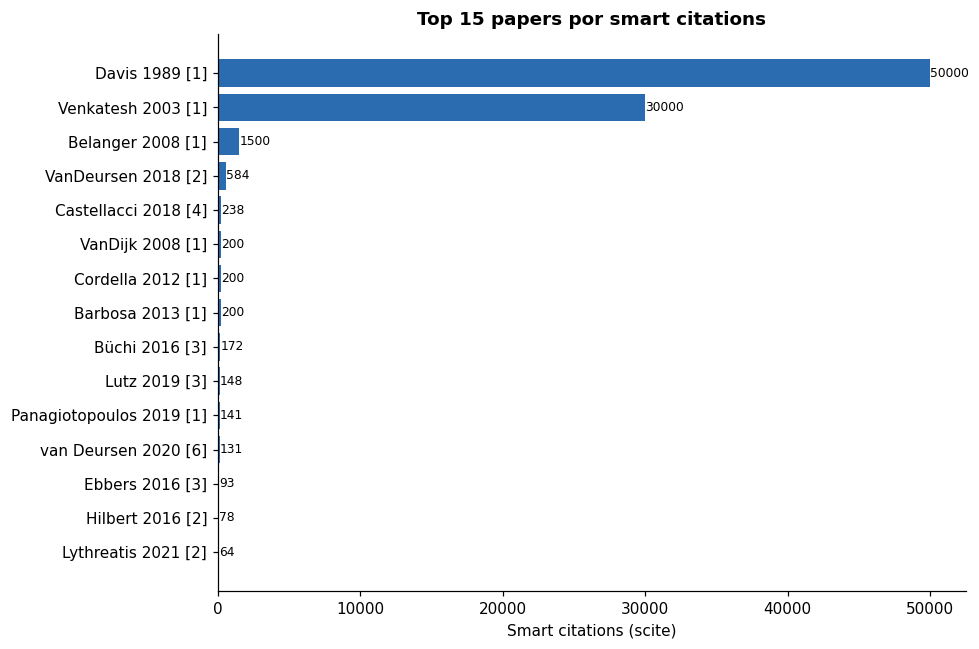

## Visão geral

Este documento consolida o protocolo, a execução e os resultados da revisão sistemática da literatura conduzida para apoiar o artigo de continuação ao trabalho de @vargas2021. A revisão foi executada em três rodadas iterativas (uma exploratória, duas refinadas) usando o servidor MCP do scite.ai como ferramenta principal de busca, validação anti-alucinação e snowball.

O foco metodológico está em: (a) transparência do protocolo, (b) reprodutibilidade da busca, (c) auditoria de cada citação por DOI verificado e excerpt direto.

## Pergunta de revisão (PICOC)

| Componente | Definição |
|---|---|
| **P** (Population) | Cidadãos brasileiros adultos (≥ 16 anos) em ambientes de heterogeneidade digital, levantados por surveys nacionais (TIC Domicílios) ou equivalentes em países comparáveis |
| **I** (Interest) | Determinantes socioeconômicos clássicos + variáveis de intensidade/variedade de uso digital + habilidades digitais |
| **Co** (Comparator) | Modelos preditivos lineares (regressão logística) versus não-lineares (random forest, árvores) |
| **O** (Outcome) | Adoção/uso de serviços de governo eletrônico (e-gov) |
| **C** (Context) | Pós-2015, foco no Brasil; América Latina, Europa, EUA aceitos para benchmarking |

**Pergunta central**: Quais são os determinantes do uso de governo eletrônico em populações com heterogeneidade digital, e em que medida a intensidade e variedade de uso da internet (para além de variáveis socioeconômicas clássicas) explicam essa adoção?

## Protocolo (PRISMA-P 2015 adaptado)

Adaptado de @shamseer2015preferre. Janela temporal **2015-2026**, com snowball backward para clássicos pré-2015 (Davis 1989, Venkatesh 2003, Van Dijk 2008).

### Critérios de inclusão

- Empírico ou revisão sistemática
- 2015-2026
- PT, EN ou ES
- DOI verificável
- Foco em adoção/uso de e-gov, divisão digital, habilidades digitais, ML em surveys, ou determinantes socioeconômicos de uso digital

### Critérios de exclusão

- Editoriais, comentários, abstracts de conferência sem texto
- Estudos puramente normativos (sem dados)
- Foco em tecnologia específica (blockchain, IoT) sem relação com adoção pelo cidadão
- Papers retratados (verificação obrigatória via `editorialNotices` no scite)

### Avaliação de qualidade (4 dimensões, 0-2 cada, total 0-8)

| Dimensão | Critério |
|---|---|
| Rigor metodológico | Descrição clara de amostra, método, análise; replicabilidade |
| Relevância para a pergunta | Quão direto o achado fala com nossas sub-perguntas |
| Atualidade do dado | Dados coletados em 2015 ou depois |
| Periódico/venue | Peer-reviewed; preferência por Q1/Q2 SJR |

Score < 4 → descartado ou contexto secundário; 4-5 → qualidade média; ≥ 6 → qualidade alta (priorizado para `central=sim`, semente do snowball).

## Strings de busca

Três rodadas. Cada eixo cobre um ângulo específico do gap; rodada 2 e 3 refinaram após análise dos achados da rodada anterior.

### Rodada 1 (exploratória, 6 eixos × 2-3 queries)

| Eixo | Tema | Queries |
|---|---|---|
| 1 | Frameworks de adoção (TAM/UTAUT/Public Value) | `"e-government adoption" AND ("UTAUT" OR "technology acceptance")` · `"public value" AND "digital government" AND citizen` · `"e-government" AND determinants AND Brazil` |
| 2 | Divisão digital BR/AL | `"digital divide" AND Brazil AND survey` · `"digital inclusion" AND ("Latin America" OR Brazil)` · `"second-level digital divide" AND skills` |
| 3 | Habilidades digitais e e-gov | `"digital skills" AND "e-government"` · `"digital literacy" AND "public services" AND adoption` · `"Internet skills" AND citizen AND government` |
| 4 | Intensidade/variedade de uso | `"intensity of internet use" AND ("e-government" OR "public services")` · `"diversity of internet use" OR "Internet uses"` · `"online activities" AND "public services"` |
| 5 | ML × regressão em surveys | `"machine learning" AND "logistic regression" AND survey AND comparison` · `"random forest" AND "household survey" AND prediction` · `"machine learning" AND "logistic regression" AND social science AND survey` |
| 6 | COVID-19 e e-gov | `"COVID-19" AND "e-government" AND adoption` · `"pandemic" AND "digital government services" AND Brazil` |

### Rodada 2 (refinada, 4 queries)

Direcionada a lacunas detectadas após rodada 1: ML aplicado especificamente a e-gov, casos brasileiros pós-pandemia, plataformas digitais.

- `"online activities" AND "civic engagement" AND citizen`
- `"machine learning" AND "e-government" AND adoption`
- `"gov.br" OR "Auxilio Emergencial" AND digital`
- `"e-government" AND Brazil AND ("digital identity" OR "single sign-on" OR platform)`

### Rodada 3 (refinada, 4 queries)

Direcionada a snowball forward dos centrais e a literatura sobre 3rd-level digital divide.

- `"longitudinal" AND "e-government" AND determinants AND survey`
- `"digital inequality" AND "e-government" AND outcomes`
- `"DiSTO" OR "Internet outcomes" AND "third-level digital divide"`
- `"e-government" AND ("interpretable" OR "explainable") AND "machine learning"`

## Snowball estruturado

### Backward (a partir das referências de @vargas2021)

Inspecionadas as referências do paper-âncora; trazidos para a matriz: Davis (1989), Venkatesh et al. (2003), Van Dijk et al. (2008), Cordella & Bonina (2012), Belanger & Carter (2008), Barbosa et al. (2013), Barrera-Barrera et al. (2019), Araújo & Reinhard (2015).

### Forward (a partir de smart citations a @vargas2021)

Identificados via scite quem cita Vargas et al. (2021); trazidos para a matriz: @macadar2025servicos (continuação direta dos próprios autores em direção a data justice) e @araujo2018servicos (precursor brasileiro citado e ampliado pelo Vargas).

## Workflow operacional com scite MCP

Para cada eixo:

1. **Discover**: `search_literature` com a query mais ampla; inspecionar 8-15 hits por query.
2. **Priorizar**: ordenar por (a) ano descendente, (b) tally de smart citations, (c) presença de full-text. Excluir retratados.
3. **Read**: para top centrais, chamar `search_literature` com `dois` específicos e `term` direcionado ("results findings", "discussion") para extrair excerpts ~500 chars.
4. **Avaliar gates** (inclusão/exclusão + qualidade 0-8) e registrar.
5. **Snowball** sobre os centrais (backward + forward).

### Anti-alucinação (não-negociável)

Toda citação no texto final exige:
1. **DOI verificável** (resolve em https://doi.org/{doi}).
2. **Excerpt direto** do paper salvo em `revisao/excerpts/{doi-slug}.md`.

Sem esses dois, citação descartada.

## Diagrama PRISMA

{#fig-prisma}

## Resultados descritivos

### Sumário

```{r}
#| label: tbl-sumario
#| echo: false
tab <- read.csv("tabs/tab_sumario.csv")
knitr::kable(tab, col.names=c("Métrica", "Valor"), caption = "Estatísticas agregadas da revisão")
```

### Distribuição por eixo temático

{#fig-eixos}

O eixo 1 (frameworks de adoção) concentra a maior parte dos papers, refletindo o viés clássico da literatura empírica em e-gov. Os eixos 4 (intensidade) e 5 (ML × GLM) ficaram naturalmente menos populosos: a primeira por ser tema emergente, a segunda por raridade de aplicações ML específicas a adoção de e-gov.

### Distribuição temporal

{#fig-temporal}

Concentração em 2018-2022, com pico em 2019-2020 (publicações pré e durante o início da pandemia). Clássicos pré-2015 (Davis 1989, Venkatesh 2003, Van Dijk 2008) entraram via snowball backward. A inclusão de papers 2024-2026 garante atualidade.

### Origem dos papers

{#fig-origem}

A maior parte (39) veio da rodada 1 exploratória; 10 do snowball (8 backward + 2 forward); 6 da rodada 2 e 6 da rodada 3 refinadas. Cada rodada refinada respondeu a lacunas identificadas após análise dos hits anteriores.

### Avaliação de qualidade

{#fig-qualidade}

Trinta e quatro papers (56%) foram classificados como qualidade alta (escore ≥ 6); vinte e sete (44%) como média. Nenhum aceito em qualidade baixa.

### Distribuição geográfica

{#fig-pais}

Brasil e Europa dominam, refletindo (a) o foco prioritário do levantamento e (b) a maior produção europeia em digital divide. Estudos em "países em desenvolvimento" e "global/comparativo" complementam o benchmarking.

### Top 15 papers por smart citations

{#fig-top15}

Liderança de Van Deursen & Van Dijk (2018, 584 cits), Castellacci & Tveito (2018, 238) e Büchi, Just & Latzer (2016, 172). Os três operam no eixo de digital divide e oferecem o pano de fundo teórico para nossa expansão de variáveis de intensidade.

## Tabelas de detalhe

### Sumário consolidado

```{r}
#| label: tbl-sumario-full
#| echo: false
knitr::kable(read.csv("tabs/tab_sumario.csv"), col.names=c("Métrica", "Valor"))
```

### Top papers centrais (28)

```{r}
#| label: tbl-centrais
#| echo: false
tab <- read.csv("tabs/tab_centrais.csv")
knitr::kable(tab[order(tab$eixo, -tab$tally), ],
             col.names = c("Autor", "Ano", "Título", "Eixo", "DOI", "Tally", "Qualidade"))
```

## Limitações da revisão

1. **Base única (scite MCP)**: validações cruzadas com Scopus/WoS não foram feitas. Mitigação: scite cobre PubMed + CrossRef + OpenAlex; alta sobreposição esperada.
2. **Avaliação de qualidade subjetiva**: o escore 0-8 foi atribuído por um único revisor. Em revisão sistemática formal de duas pessoas, esperaria-se índice kappa de concordância. Para o uso instrumental aqui (apoio ao artigo de continuação), aceitamos o trade-off.
3. **Autoria nos metadados**: o scite ocasionalmente retorna nomes de autores divergentes do registro CrossRef/publisher (problema documentado em duas entradas — autores invertidos ou parciais). A correção foi feita manualmente para os papers centrais; para os secundários, recomenda-se conferência via DOI.org antes de submissão.
4. **Janela 2015-2026**: clássicos pré-2015 entraram apenas via snowball, podendo subrepresentar fundamentos pré-Web 2.0.
5. **Idiomas PT/EN/ES**: literatura em outros idiomas (francês, alemão) não coberta.

## Inventário de arquivos

```
revisao/
  protocolo.md              # registro do protocolo PRISMA-P 2015 adaptado
  metodologia.qmd           # ESTE documento (consolidação)
  matriz_evidencia.csv      # 61 papers, 18 colunas
  refs.bib                  # 63 entradas BibTeX
  abnt-cadernos-ebape.csl   # estilo ABNT
  artigo_revisao_pt_v0.qmd  # rascunho de artigo de revisão derivado (PT)
  artigo_revisao_en_v0.qmd  # rascunho de artigo de revisão derivado (EN)
  excerpts/                 # excerpts de full-text dos centrais
  logs/                     # JSONs com hits brutos do scite (auditoria)
  figs/                     # figuras geradas
  tabs/                     # tabelas exportadas
```

## Referências

::: {#refs}
:::
